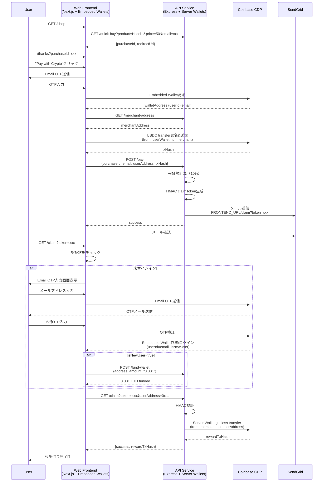

# MVP Final Design - Crypify ハッカソン版

## 🎯 目的
ショッピングカートで決済成功した人のメールアドレスに紐づくWalletに決済額の10%のUSDCを割り当てる。

## 🔑 CDP技術選定（確定版）

### ハイブリッド構成：Embedded Wallets + Server Wallets

**重要な理解：CDPには2系統ある**

1. **Embedded Wallets**（ユーザー自身のウォレット）
   - メールOTP/OAuth認証でユーザーがログイン
   - CDP側が `userId(sub)` に紐づけて自動で wallet を管理
   - **鍵はユーザー側**（自己管理型）
   - フロント側で署名・送金処理
   - **今回の用途：ユーザーの決済Wallet**

2. **Server Wallets**（開発者が管理するアカウント）
   - サーバー側から作る開発者コントロールのEOA/スマートアカウント
   - `account name` で `getOrCreateAccount(name)` 可能
   - **鍵はサーバー側**（CDP管理）
   - バックエンドから送金処理
   - **今回の用途：Merchant受取＆報酬配布用Wallet**

### なぜハイブリッド？

| 処理 | 使用技術 | 理由 |
|-----|---------|------|
| **ユーザー決済** | Embedded Wallets | ユーザー自身のUSDCで支払い（自己管理） |
| **報酬配布** | Server Wallets | サーバーから自動でgasless transfer |
| **Wallet存在判別** | CDP自動管理 | DB不要（CDP側が`userId=email`で永続化） |

### DB不要の根拠

- Embedded Wallets: CDP側が `userId(sub)` → wallet を永続管理
- 同じemailで再ログイン → 同じwalletに自動復帰
- Server Wallets: `getOrCreateAccount(name)` で存在判別不要

### 複数クレーム防止は？

**MVP方針：DBなし＝リプレイ許容**
- HMAC署名で**改ざん防止**のみ実装
- 一回性は時間があればFirestoreで `claims/{claimId}` 追加

---

## 📋 MVP スコープ（最小限実装）

### ✅ 実装する機能

1. **Quick Buy API**（ハッカソンデモ用）
   - `GET /api/quick-buy?product=Hoodie&price=50&email=user@example.com`
   - 商品管理なし、在庫管理なし
   - 個数は常に1個固定
   - purchaseId返却のみ

2. **Crypto決済フロー**（Embedded Wallets）
   - フロントエンド：Email OTP認証でEmbedded Wallet作成/ログイン
   - ユーザーのUSDCで支払い（フロント側で署名）
   - txHashをバックエンドに通知

3. **報酬確定とメール送信**
   - バックエンド：決済通知受信 → 購入額の10% USDC報酬確定
   - HMAC署名付きclaimトークン生成
   - メール送信：`FRONTEND_URL/claim?token=xxx`

4. **Claim処理**（Embedded Wallets自動作成 + Server Walletsでgasless transfer）
   - ユーザーがメールのClaimリンクをクリック
   - **Claim画面で認証チェック：**
     - 既にサインイン済み → 即座にClaim実行
     - 未サインイン → Email OTP認証フロー開始
   - **Email OTP認証（CDP Embedded Wallets）：**
     - メールアドレス入力 → CDP経由でOTP送信
     - 6桁コード検証 → CDP側でEmbedded Wallet自動作成/既存ログイン
     - 新規ユーザーの場合 → 0.001 ETHをファンド（gas代）
   - GET `/api/claim?token=xxx&userAddress=0x...` でtoken検証
   - Merchant Server WalletからユーザーアドレスへUSDC送金（gasless）
   - 完了通知

### ❌ 実装しない機能（時間があれば）

- 複数クレーム防止（HMAC署名で改ざん防止のみ、リプレイは許容）
- クレジットカード決済UI（Cryptoのみ）
- 在庫管理・商品管理
- CDP OnRamp統合（時間があれば）

---

## 🏗️ アーキテクチャ設計

### 役割分担（確定版）

```
ユーザー決済: Embedded Wallets（フロント側署名）
    ↓
  支払い通知
    ↓
報酬配布: Server Wallets（バックエンドgasless transfer）
```

### 固定値（事前準備）

1. **USDC Contract（Base Sepolia）**
   - `0x036CbD53842c5426634e7929541eC2318f3dCF7e`

2. **Merchant Server Wallet**
   - 一度だけ作成して `MERCHANT_WALLET_ID` 環境変数で固定
   - 用途：
     - ユーザーからUSDC受取
     - ユーザーへ報酬配布（gasless）

### システムフロー



---

## 🔧 技術実装詳細

### 共通：HMAC署名ユーティリティ

**ファイル:** `/api/src/lib/claimToken.ts`

```typescript
import crypto from "crypto";

const SECRET = process.env.CLAIM_SECRET!; // 長いランダム文字列

export function makeClaimToken(payload: object) {
  const json = JSON.stringify(payload);
  const b64 = Buffer.from(json).toString("base64url");
  const sig = crypto.createHmac("sha256", SECRET).update(b64).digest("base64url");
  return `${b64}.${sig}`;
}

export function verifyClaimToken(token: string) {
  const [b64, sig] = token.split(".");
  const expected = crypto.createHmac("sha256", SECRET).update(b64).digest("base64url");
  if (sig !== expected) throw new Error("Invalid signature");
  const json = Buffer.from(b64, "base64url").toString("utf8");
  return JSON.parse(json);
}
```

---

### 1. Quick Buy API

**Endpoint:** `GET /api/quick-buy`

**実装:** `/api/src/routes/quickBuy.ts`

```typescript
import { Router } from "express";
import crypto from "crypto";

const router = Router();

// In-memory storage (Cloud Run再起動で消える = MVP許容)
const purchases = new Map();

router.get("/", (req, res) => {
  const { product, price, email } = req.query;
  
  if (!product || !price || !email) {
    return res.status(400).json({ error: "Missing required parameters" });
  }
  
  const purchaseId = `PUR-${Date.now()}-${crypto.randomBytes(4).toString('hex')}`;
  const priceUsd = Number(price);
  
  purchases.set(purchaseId, {
    product,
    priceUsd,
    email,
    createdAt: Date.now()
  });
  
  const redirectUrl = `${process.env.FRONTEND_URL}/thanks?purchaseId=${purchaseId}&email=${encodeURIComponent(String(email))}`;
  
  res.json({
    purchaseId,
    product,
    priceUsd,
    email,
    redirectUrl
  });
});

export { purchases }; // Pay endpointで参照
export default router;
```

---

### 2. Merchant Address API

**Endpoint:** `GET /api/merchant-address`

**実装:** `/api/src/routes/merchant.ts`

```typescript
import { Router } from "express";
import { getMerchantWallet } from "../lib/cdp";

const router = Router();

router.get("/", async (req, res) => {
  try {
    const merchant = await getMerchantWallet();
    const address = await merchant.getDefaultAddress();
    
    res.json({
      merchantAddress: address.getId()
    });
  } catch (err) {
    console.error("Get merchant address error:", err);
    res.status(500).json({ error: "Failed to get merchant address" });
  }
});

export default router;
```

---

### 3. Pay Endpoint（支払い通知受信）

**Endpoint:** `POST /api/pay`

**実装:** `/api/src/routes/pay.ts`

```typescript
import { Router } from "express";
import { purchases } from "./quickBuy";
import { makeClaimToken } from "../lib/claimToken";
import { sendEmail } from "../services/email";

const router = Router();

router.post("/", async (req, res) => {
  const { purchaseId, email, userAddress, txHash } = req.body;
  
  if (!purchaseId || !email || !userAddress || !txHash) {
    return res.status(400).json({ error: "Missing required fields" });
  }
  
  const purchase = purchases.get(purchaseId);
  if (!purchase) {
    return res.status(404).json({ error: "Purchase not found" });
  }
  
  // 報酬額計算（10%）
  const rewardUsd = (purchase.priceUsd * 0.1).toFixed(2);
  
  // Claim token生成（HMAC署名付き）
  const expiresAt = Date.now() + 1000 * 60 * 60 * 24; // 24h
  const token = makeClaimToken({
    email,
    userAddress,
    rewardUsd,
    purchaseId,
    expiresAt
  });
  
  const claimUrl = `${process.env.FRONTEND_URL}/claim?token=${encodeURIComponent(token)}`;
  
  // メール送信
  try {
    await sendEmail({
      to: email,
      subject: "🎉 You earned USDC rewards!",
      html: `
        <h1>Thanks for your purchase!</h1>
        <p>Payment transaction: <a href="https://sepolia.basescan.org/tx/${txHash}">${txHash.slice(0, 10)}...</a></p>
        <p>You earned <strong>${rewardUsd} USDC</strong> (10% of your purchase)</p>
        <p><a href="${claimUrl}" style="background: #667eea; color: white; padding: 12px 24px; text-decoration: none; border-radius: 4px; display: inline-block;">Claim Your Reward</a></p>
        <p><small>This link expires in 24 hours</small></p>
      `
    });
  } catch (err) {
    console.error("Email send error:", err);
    return res.status(500).json({ error: "Failed to send email" });
  }
  
  res.json({
    success: true,
    rewardUsd,
    claimUrl
  });
});

export default router;
```

---

### 4. Claim Endpoint（報酬配布）

**Endpoint:** `GET /api/claim`

**実装:** `/api/src/routes/claim.ts`

```typescript
import { Router } from "express";
import { verifyClaimToken } from "../lib/claimToken";
import { getMerchantWallet } from "../lib/cdp";
import { Coinbase } from "@coinbase/coinbase-sdk";

const USDC_BASE_SEPOLIA = "0x036CbD53842c5426634e7929541eC2318f3dCF7e";

const router = Router();

router.get("/", async (req, res) => {
  try {
    const token = String(req.query.token || "");
    
    // Token検証（HMAC）
    const payload = verifyClaimToken(token);
    const { userAddress, rewardUsd, expiresAt, email } = payload;
    
    // 期限チェック
    if (Date.now() > expiresAt) {
      return res.status(410).json({ error: "Claim link expired" });
    }
    
    // Merchant Server Walletから gasless transfer
    const merchant = await getMerchantWallet();
    
    const transfer = await merchant.createTransfer({
      amount: Number(rewardUsd),
      assetId: USDC_BASE_SEPOLIA, // Base Sepolia USDC
      destination: userAddress,
      gasless: true,
      skipBatching: true // 即座に反映
    });
    
    await transfer.wait();
    
    const txHash = transfer.getTransaction().getTransactionHash();
    
    console.log(`✅ Reward claimed: ${rewardUsd} USDC to ${userAddress} (tx: ${txHash})`);
    
    res.json({
      success: true,
      email,
      userAddress,
      rewardUsd,
      txHash,
      message: `${rewardUsd} USDC claimed successfully!`
    });
    
  } catch (err: any) {
    console.error("Claim error:", err);
    
    if (err.message === "Invalid signature") {
      return res.status(400).json({ error: "Invalid or tampered claim link" });
    }
    
    res.status(500).json({ error: "Failed to claim reward" });
  }
});

export default router;
```

---

### 5. CDP初期化（Server Wallets）

**ファイル:** `/api/src/lib/cdp.ts`

```typescript
import { Coinbase, Wallet } from "@coinbase/coinbase-sdk";

// CDP SDK初期化（一度だけ）
Coinbase.configure({
  apiKeyName: process.env.CDP_API_KEY_ID!,
  privateKey: process.env.CDP_API_SECRET!.replace(/\\n/g, '\n')
});

// Merchant Server Wallet取得（固定ID）
export async function getMerchantWallet(): Promise<Wallet> {
  const walletId = process.env.MERCHANT_WALLET_ID!;
  
  if (!walletId) {
    throw new Error("MERCHANT_WALLET_ID not configured");
  }
  
  // 既存walletを取得
  const wallet = await Wallet.fetch(walletId);
  
  return wallet;
}
```

---

### 6. フロントエンド：決済UI（Embedded Wallets）

**ファイル:** `/web/app/thanks/PayWithCrypto.tsx`

```tsx
"use client";

import { useState } from "react";
import {
  useSignInWithEmail,
  useVerifyEmailOTP,
  useIsSignedIn,
  useEvmAddress,
} from "@coinbase/cdp-hooks";
import { createPublicClient, http, parseUnits, createWalletClient, custom } from "viem";
import { baseSepolia } from "viem/chains";

const USDC_BASE_SEPOLIA = "0x036CbD53842c5426634e7929541eC2318f3dCF7e" as const;

const ERC20_ABI = [
  {
    type: "function",
    name: "transfer",
    stateMutability: "nonpayable",
    inputs: [
      { name: "to", type: "address" },
      { name: "amount", type: "uint256" },
    ],
    outputs: [{ name: "", type: "bool" }],
  },
] as const;

interface Props {
  purchaseId: string;
  email: string;
  priceUsd: number;
}

export default function PayWithCrypto({ purchaseId, email: initialEmail, priceUsd }: Props) {
  const [email, setEmail] = useState(initialEmail);
  const [otp, setOtp] = useState("");
  const [flowId, setFlowId] = useState<string | null>(null);
  const [status, setStatus] = useState("");
  const [paying, setPaying] = useState(false);

  const signIn = useSignInWithEmail();
  const verifyOtp = useVerifyEmailOTP();
  const isSignedIn = useIsSignedIn();
  const evmAddress = useEvmAddress();

  async function startEmailLogin() {
    setStatus("Sending OTP...");
    try {
      const result = await signIn(email);
      setFlowId(result.flowId);
      setStatus("OTP sent to your email");
    } catch (err) {
      setStatus("Failed to send OTP");
      console.error(err);
    }
  }

  async function finishEmailLogin() {
    if (!flowId) return;
    setStatus("Verifying OTP...");
    try {
      await verifyOtp({ flowId, otp });
      setStatus("Signed in successfully!");
    } catch (err) {
      setStatus("Invalid OTP");
      console.error(err);
    }
  }

  async function payUsdc() {
    if (!evmAddress) {
      setStatus("Wallet not ready");
      return;
    }

    setPaying(true);
    setStatus("Getting merchant address...");

    try {
      // 1) Merchant address取得
      const merchantRes = await fetch(`${process.env.NEXT_PUBLIC_API_BASE_URL}/merchant-address`);
      const { merchantAddress } = await merchantRes.json();

      // 2) USDC送金（Embedded Walletで署名）
      setStatus("Preparing transaction...");
      
      const walletClient = createWalletClient({
        account: evmAddress as `0x${string}`,
        chain: baseSepolia,
        transport: custom(window.ethereum!)
      });

      const amount = parseUnits(String(priceUsd), 6); // USDC 6 decimals

      setStatus("Please confirm transaction in your wallet...");
      
      const txHash = await walletClient.writeContract({
        address: USDC_BASE_SEPOLIA,
        abi: ERC20_ABI,
        functionName: "transfer",
        args: [merchantAddress as `0x${string}`, amount],
        chain: baseSepolia,
      });

      setStatus(`Payment sent! Tx: ${txHash.slice(0, 10)}...`);

      // 3) Backend に通知
      await fetch(`${process.env.NEXT_PUBLIC_API_BASE_URL}/pay`, {
        method: "POST",
        headers: { "Content-Type": "application/json" },
        body: JSON.stringify({
          purchaseId,
          email,
          userAddress: evmAddress,
          txHash,
        }),
      });

      setStatus("✅ Payment complete! Check your email for reward claim link.");
      
    } catch (err: any) {
      console.error("Payment error:", err);
      setStatus(`Payment failed: ${err.message}`);
    } finally {
      setPaying(false);
    }
  }

  return (
    <div className="card">
      <h2>💰 Pay with Crypto (USDC)</h2>
      
      {!isSignedIn ? (
        <div>
          <div className="form-group">
            <label>Email</label>
            <input
              type="email"
              value={email}
              onChange={(e) => setEmail(e.target.value)}
              placeholder="your@email.com"
            />
          </div>
          
          <button onClick={startEmailLogin} className="button">
            Send OTP
          </button>

          {flowId && (
            <>
              <div className="form-group" style={{ marginTop: '20px' }}>
                <label>Enter OTP Code</label>
                <input
                  type="text"
                  value={otp}
                  onChange={(e) => setOtp(e.target.value)}
                  placeholder="123456"
                  maxLength={6}
                />
              </div>
              <button onClick={finishEmailLogin} className="button">
                Verify OTP
              </button>
            </>
          )}
        </div>
      ) : (
        <div>
          <p><strong>Wallet:</strong> {evmAddress?.slice(0, 6)}...{evmAddress?.slice(-4)}</p>
          <p><strong>Amount:</strong> {priceUsd} USDC</p>
          
          <button
            onClick={payUsdc}
            disabled={paying}
            className="button"
            style={{ width: '100%', marginTop: '20px' }}
          >
            {paying ? "Processing..." : `Pay ${priceUsd} USDC`}
          </button>
        </div>
      )}

      {status && (
        <div style={{
          marginTop: '20px',
          padding: '12px',
          background: '#f0f0f0',
          borderRadius: '4px',
          fontSize: '14px'
        }}>
          {status}
        </div>
      )}
    </div>
  );
}
```

---

### 7. フロントエンド：Claimページ

**ファイル:** `/web/app/claim/page.tsx`

```tsx
"use client";

import { useSearchParams } from "next/navigation";
import { useState, useEffect, Suspense } from "react";

function ClaimContent() {
  const searchParams = useSearchParams();
  const token = searchParams.get("token");
  
  const [loading, setLoading] = useState(true);
  const [result, setResult] = useState<any>(null);
  const [error, setError] = useState("");

  useEffect(() => {
    if (!token) {
      setError("Invalid claim link");
      setLoading(false);
      return;
    }

    claimReward();
  }, [token]);

  async function claimReward() {
    try {
      const res = await fetch(
        `${process.env.NEXT_PUBLIC_API_BASE_URL}/claim?token=${encodeURIComponent(token!)}`
      );
      
      if (!res.ok) {
        const data = await res.json();
        throw new Error(data.error || "Claim failed");
      }
      
      const data = await res.json();
      setResult(data);
    } catch (err: any) {
      setError(err.message);
    } finally {
      setLoading(false);
    }
  }

  if (loading) {
    return (
      <div className="container">
        <div className="card">
          <div className="loading">Claiming your reward...</div>
        </div>
      </div>
    );
  }

  if (error) {
    return (
      <div className="container">
        <div className="card">
          <div className="error">{error}</div>
        </div>
      </div>
    );
  }

  if (result) {
    return (
      <div className="container">
        <div className="card">
          <h1 style={{ fontSize: '36px', marginBottom: '20px', textAlign: 'center' }}>
            🎉 Reward Claimed!
          </h1>

          <div className="success">
            {result.message}
          </div>

          <div style={{ background: '#f9f9f9', padding: '24px', borderRadius: '8px', marginBottom: '24px' }}>
            <h3 style={{ marginBottom: '16px' }}>Transaction Details</h3>
            
            <p style={{ marginBottom: '12px', wordBreak: 'break-all' }}>
              <strong>Email:</strong><br />
              {result.email}
            </p>

            <p style={{ marginBottom: '12px', wordBreak: 'break-all' }}>
              <strong>Wallet Address:</strong><br />
              {result.userAddress}
            </p>

            <p style={{ marginBottom: '12px', wordBreak: 'break-all' }}>
              <strong>Reward Amount:</strong><br />
              {result.rewardUsd} USDC
            </p>

            <p style={{ marginBottom: '12px', wordBreak: 'break-all' }}>
              <strong>Transaction:</strong><br />
              <a 
                href={`https://sepolia.basescan.org/tx/${result.txHash}`}
                target="_blank"
                rel="noopener noreferrer"
                style={{ color: '#667eea' }}
              >
                {result.txHash}
              </a>
            </p>
          </div>

          <a href="/shop" className="button" style={{ width: '100%', textAlign: 'center', display: 'block' }}>
            Shop More 🛍️
          </a>
        </div>
      </div>
    );
  }

  return null;
}

export default function ClaimPage() {
  return (
    <Suspense fallback={
      <div className="container">
        <div className="card">
          <div className="loading">Loading...</div>
        </div>
      </div>
    }>
      <ClaimContent />
    </Suspense>
  );
}
```

---

## 🚀 デプロイ手順

### 1. Embedded Wallets設定（CDP Portal）

1. [CDP Portal](https://portal.cdp.coinbase.com/) → Embedded Wallets
2. Domain設定でCloud Run URLを追加：
   - `https://crypify-web-xxx.a.run.app`
3. Project IDをコピー

### 2. 環境変数設定（Secret Manager）

**Web Service用:**
```bash
echo -n "YOUR_PROJECT_ID" | gcloud secrets create CDP_PROJECT_ID --data-file=-
echo -n "https://crypify-api-xxx.a.run.app" | gcloud secrets versions add API_BASE_URL --data-file=-
```

**API Service用（追加）:**
```bash
echo -n "YOUR_JWT_SECRET" | gcloud secrets create JWT_SECRET --data-file=-
```

### 3. GitHub Actions更新

**`.github/workflows/deploy-web.yml`:**
```yaml
- name: Deploy to Cloud Run
  run: |
    gcloud run deploy $SERVICE_NAME \
      --image $ARTIFACT_REGISTRY/$PROJECT_ID/$REPOSITORY/$SERVICE_NAME:${{ github.sha }} \
      --region $REGION \
      --platform managed \
      --allow-unauthenticated \
      --set-env-vars "NODE_ENV=production,NEXT_PUBLIC_PROJECT_ID=${{ secrets.CDP_PROJECT_ID }}" \
      --update-secrets "API_BASE_URL=API_BASE_URL:latest"
```

**`.github/workflows/deploy-api.yml`:**
```yaml
- name: Deploy to Cloud Run
  run: |
    gcloud run deploy $SERVICE_NAME \
      --image $ARTIFACT_REGISTRY/$PROJECT_ID/$REPOSITORY/$SERVICE_NAME:${{ github.sha }} \
      --region $REGION \
      --platform managed \
      --allow-unauthenticated \
      --update-secrets "CDP_API_KEY=CDP_API_KEY:latest,CDP_API_SECRET=CDP_API_SECRET:latest,SENDGRID_API_KEY=SENDGRID_API_KEY:latest,FROM_EMAIL=FROM_EMAIL:latest,FRONTEND_URL=FRONTEND_URL:latest,API_BASE_URL=API_BASE_URL:latest,JWT_SECRET=JWT_SECRET:latest"
```

---

## 📊 MVP vs フル機能比較

| 機能 | MVP（最小限） | フル版（時間があれば） |
|------|------------|-------------------|
| 商品管理 | ❌ ダミー固定 | ✅ DB管理 |
| 決済処理 | ❌ 常に成功 | ✅ CDP OnRamp統合 |
| Wallet作成 | ✅ Embedded Wallets | ✅ Embedded Wallets |
| 報酬付与 | ✅ Gasless Transfer | ✅ Gasless Transfer |
| 複数クレーム防止 | ❌ 未実装 | ✅ DB記録 |
| USDC払い | ❌ 未実装 | ✅ Wallet残高チェック |
| OnRamp UI | ❌ 未実装 | ✅ FundModal統合 |

---

## 🛡️ セキュリティ考慮事項

### JWT Claim Token
- **有効期限:** 7日間
- **署名検証:** `jwt.verify()`で必須
- **Payload:** `{email, amount, purchaseId, timestamp}`

### Gasless Transfer制限
- **送信元:** Admin Wallet（CDP Server Wallets管理）
- **ネットワーク:** Base Sepolia（テストネット）
- **資産:** USDC のみ
- **上限:** 管理者Wallet残高まで

### Cloud Run環境
- **Stateless:** 再起動で`purchases` Mapは消失
- **許容範囲:** MVPでは問題なし（デモ用）
- **本番対応:** Firestore / PostgreSQL導入必要

---

## 📝 次のステップ

### Phase 1: MVP実装（必須）
1. ✅ Web Service デプロイ
2. ⏳ Quick Buy API作成
3. ⏳ Pay endpoint修正（ダミー決済）
4. ⏳ Claim endpoint作成
5. ⏳ Embedded Wallets統合（フロントエンド）

### Phase 2: 改善（時間があれば）
1. CDP OnRamp統合（`FundModal`コンポーネント）
2. 複数クレーム防止（Firestore）
3. USDC払いオプション（Wallet残高チェック）
4. トランザクション履歴表示

---

## 🔗 参考リンク

- [CDP Embedded Wallets Docs](https://docs.cdp.coinbase.com/embedded-wallets/)
- [Gasless Transfer Guide](https://docs.cdp.coinbase.com/server-wallets/v1/concepts/transfers)
- [OnRamp Integration](https://docs.cdp.coinbase.com/embedded-wallets/onramp-integration)
- [CDP React Components](https://www.npmjs.com/package/@coinbase/cdp-react)
