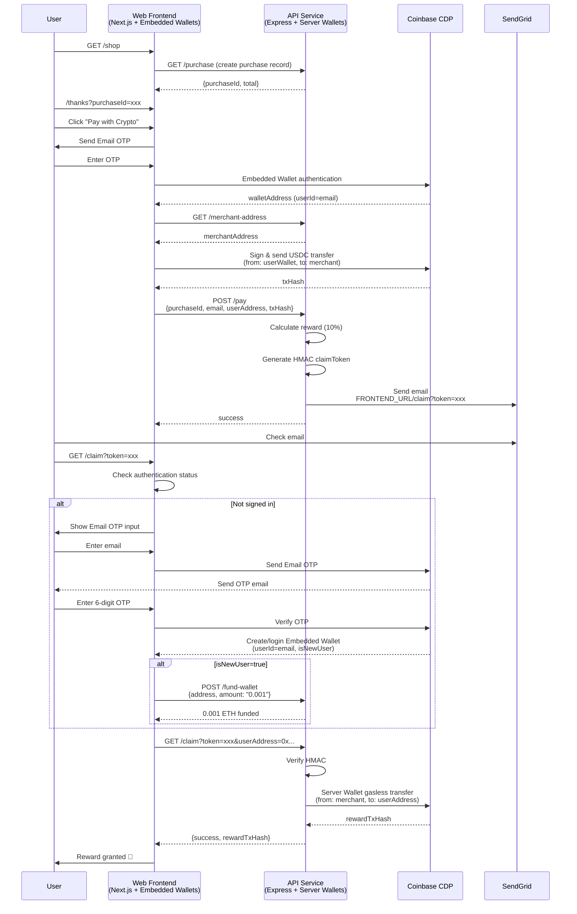

# MVP Final Design - Crypify

## 🎯 Objective

Allocate 10% of the purchase amount in USDC as rewards to users' wallets linked to their email addresses after successful crypto payment.

## 🔑 CDP Technology Stack

### Hybrid Architecture: Embedded Wallets + Server Wallets

**Key Concept: CDP has two distinct wallet systems**

#### 1. Embedded Wallets (User-Controlled Wallets)
- Email OTP / OAuth authentication for user login
- CDP automatically manages wallets linked to `userId(sub)`
- **Keys controlled by users** (self-custodial)
- Transaction signing happens on the frontend
- **Use case**: User payment wallets

#### 2. Server Wallets (Developer-Controlled Accounts)
- Server-side EOA/Smart Accounts created by developers
- Accessible via `getOrCreateAccount(name)` using account names
- **Keys managed by server** (CDP-managed)
- Backend-initiated transfers
- **Use case**: Merchant receiving & reward distribution wallet

### Why Hybrid?

| Process | Technology | Reason |
|---------|-----------|--------|
| **User Payment** | Embedded Wallets | Users pay with their own USDC (self-custodial) |
| **Reward Distribution** | Server Wallets | Automated gasless transfers from server |
| **Wallet Detection** | CDP Auto-Management | No database needed (CDP persists `userId=email` → wallet mapping) |

### No Database Required

**Rationale:**
- Embedded Wallets: CDP persists `userId(sub)` → wallet mapping
- Same email re-login → automatically restores same wallet
- Server Wallets: `getOrCreateAccount(name)` handles existence check

### Preventing Duplicate Claims

**MVP Approach: No DB = Replay Tolerance**
- Implements **tampering prevention** via HMAC signatures only
- One-time use enforcement: Optional Firestore `claims/{claimId}` tracking if time permits

---

## 📋 MVP Scope (Minimum Implementation)

### ✅ Implemented Features

1. **Quick Buy API** (Demo)
   - `GET /api/quick-buy?product=Hoodie&price=50&email=user@example.com`
   - No product/inventory management
   - Fixed quantity: 1 per purchase
   - Returns purchaseId only

2. **Crypto Payment Flow** (Embedded Wallets)
   - Frontend: Email OTP auth creates/logs into Embedded Wallet
   - User pays with their USDC (frontend signature)
   - txHash sent to backend

3. **Reward Confirmation & Email**
   - Backend: Receives payment notification → calculates 10% USDC reward
   - Generates HMAC-signed claim token
   - Sends email: `FRONTEND_URL/claim?token=xxx`

4. **Claim Processing** (Embedded Wallets Auto-Creation + Server Wallets Gasless Transfer)
   - User clicks claim link from email
   - **Claim page authentication check:**
     - Already signed in → Execute claim immediately
     - Not signed in → Start Email OTP authentication flow
   - **Email OTP Authentication (CDP Embedded Wallets):**
     - Enter email → CDP sends OTP
     - Verify 6-digit code → CDP auto-creates/logs into Embedded Wallet
     - New users → Fund with 0.001 ETH (for gas)
   - `GET /api/claim?token=xxx&userAddress=0x...` validates token
   - Merchant Server Wallet sends USDC to user address (gasless)
   - Completion notification

### ❌ Not Implemented (If Time Permits)

- Duplicate claim prevention (HMAC signature prevents tampering only, replays tolerated)
- Credit card payment UI (crypto only)
- Inventory/product management
- CDP OnRamp integration

---

## 🏗️ Architecture Design

### Role Distribution

```
User Payment: Embedded Wallets (Frontend signature)
    ↓
  Payment notification
    ↓
Reward Distribution: Server Wallets (Backend gasless transfer)
```

### Fixed Values (Pre-configured)

1. **USDC Contract (Base Sepolia)**
   - `0x036CbD53842c5426634e7929541eC2318f3dCF7e`

2. **Merchant Server Wallet**
   - Created once, fixed via `MERCHANT_WALLET_ADDRESS` environment variable
   - Purpose:
     - Receive USDC from users
     - Distribute rewards to users (gasless)

### System Flow



---

## 🔧 Technical Implementation

### Environment Variables

**API Service:**
```env
CDP_API_KEY=your_api_key_name
CDP_API_SECRET=your_api_secret
CDP_WALLET_SECRET=wallet_seed_data
MERCHANT_WALLET_ADDRESS=0x...
CLAIM_SECRET=long_random_string
SENDGRID_API_KEY=SG.xxx
FROM_EMAIL=noreply@crypify.app
FRONTEND_URL=https://crypify-web-xxx.a.run.app
```

**Web Service:**
```env
NEXT_PUBLIC_CDP_PROJECT_ID=cc8f0896-eaa0-4631-ad55-73f01a4eb3d2
NEXT_PUBLIC_API_BASE_URL=https://crypify-api-xxx.a.run.app
```

### HMAC Signature Utility

**File:** `/api/src/lib/claimToken.ts`

```typescript
import crypto from "crypto";

const SECRET = process.env.CLAIM_SECRET!;

export function makeClaimToken(payload: object) {
  const json = JSON.stringify(payload);
  const b64 = Buffer.from(json).toString("base64url");
  const sig = crypto.createHmac("sha256", SECRET).update(b64).digest("base64url");
  return `${b64}.${sig}`;
}

export function verifyClaimToken(token: string) {
  const [b64, sig] = token.split(".");
  const expected = crypto.createHmac("sha256", SECRET).update(b64).digest("base64url");
  if (sig !== expected) throw new Error("Invalid signature");
  const json = Buffer.from(b64, "base64url").toString("utf8");
  return JSON.parse(json);
}
```

---

## 🚀 Deployment

### Cloud Run Services

**API Service:**
```bash
gcloud run deploy crypify-api \
  --region=asia-northeast1 \
  --update-secrets=CDP_API_KEY=CDP_API_KEY:latest \
  --update-secrets=CDP_API_SECRET=CDP_API_SECRET:latest \
  --update-secrets=CDP_WALLET_SECRET=CDP_WALLET_SECRET:latest \
  --update-secrets=MERCHANT_WALLET_ADDRESS=MERCHANT_WALLET_ADDRESS:latest \
  --update-secrets=CLAIM_SECRET=CLAIM_SECRET:latest \
  --update-secrets=SENDGRID_API_KEY=SENDGRID_API_KEY:latest \
  --update-secrets=FROM_EMAIL=FROM_EMAIL:latest \
  --update-secrets=FRONTEND_URL=FRONTEND_URL:latest
```

**Web Service:**
```bash
# Build with environment variables embedded
docker build \
  --build-arg NEXT_PUBLIC_CDP_PROJECT_ID="..." \
  --build-arg NEXT_PUBLIC_API_BASE_URL="..." \
  -t crypify-web .

gcloud run deploy crypify-web \
  --region=asia-northeast1
```

### GitHub Actions

Automated deployment on push to `main`:
- `.github/workflows/deploy-api.yml` - API deployment
- `.github/workflows/deploy-web.yml` - Web deployment (with build-time env vars)

---

## 📊 MVP vs Full Feature Comparison

| Feature | MVP (Minimum) | Full Version (If Time Permits) |
|---------|--------------|-------------------------------|
| Product Management | ❌ Dummy/Fixed | ✅ DB Management |
| Payment Processing | ✅ Crypto Only | ✅ CDP OnRamp Integration |
| Wallet Creation | ✅ Embedded Wallets | ✅ Embedded Wallets |
| Reward Distribution | ✅ Gasless Transfer | ✅ Gasless Transfer |
| Duplicate Prevention | ❌ Not Implemented | ✅ DB Recording |
| USDC Balance Check | ❌ Not Implemented | ✅ Wallet Balance Check |
| OnRamp UI | ❌ Not Implemented | ✅ FundModal Integration |

---

## 🛡️ Security Considerations

### HMAC Claim Token
- **Expiration:** 24 hours
- **Signature Verification:** `crypto.createHmac()` required
- **Payload:** `{email, userAddress, rewardUsd, expiresAt}`

### Gasless Transfer Limits
- **Source:** Merchant Wallet (CDP Server Wallets managed)
- **Network:** Base Sepolia (testnet)
- **Asset:** USDC only
- **Maximum:** Limited by merchant wallet balance

### Cloud Run Environment
- **Stateless:** In-memory `purchases` Map cleared on restart
- **Acceptable:** MVP demo scope
- **Production:** Requires Firestore / PostgreSQL

---

## 📝 Implementation Checklist

### Phase 1: MVP (Required)
- ✅ Web Service deployment
- ✅ Purchase API creation
- ✅ Pay endpoint (payment notification)
- ✅ Claim endpoint (reward distribution)
- ✅ Embedded Wallets integration (frontend)
- ✅ Email notifications
- ✅ HMAC token security

### Phase 2: Enhancements (Optional)
- ⏳ CDP OnRamp integration (`FundModal` component)
- ⏳ Duplicate claim prevention (Firestore)
- ⏳ USDC payment option (wallet balance check)
- ⏳ Transaction history display

---

## 🔗 References

- [CDP Embedded Wallets Documentation](https://docs.cdp.coinbase.com/embedded-wallets/)
- [CDP Server Wallets - Gasless Transfers](https://docs.cdp.coinbase.com/server-wallets/v1/concepts/transfers)
- [OnRamp Integration Guide](https://docs.cdp.coinbase.com/embedded-wallets/onramp-integration)
- [CDP React Components](https://www.npmjs.com/package/@coinbase/cdp-hooks)

---

## 📐 Current Production Status

**Deployed URLs:**
- Web: https://crypify-web-kkz6k4jema-an.a.run.app
- API: https://crypify-api-kkz6k4jema-an.a.run.app

**Stable Release Branch:** `release`

**Active Development Branch:** `main`
