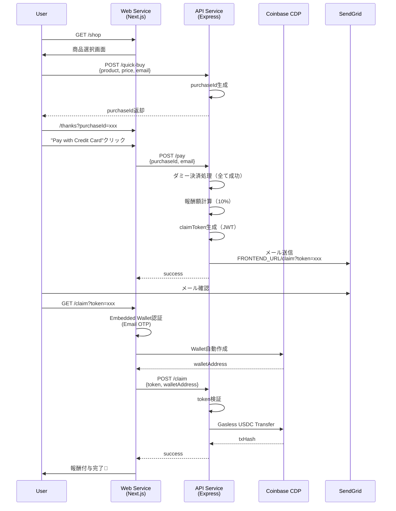

# MVP Final Design - Crypify ハッカソン版

## 🎯 目的
ショッピングカートで決済成功した人のメールアドレスに紐づくWalletに決済額の10%のUSDCを割り当てる。
WalletはCoinbase CDP **Embedded Wallets**で作成。

---

## 📋 MVP スコープ（最小限実装）

### ✅ 実装する機能

1. **Quick Buy API**（ハッカソンデモ用）
   - `GET /api/quick-buy?product=Hoodie&price=50&email=user@example.com`
   - 商品管理なし、在庫管理なし
   - 個数は常に1個固定

2. **ダミー決済フロー**
   - クレジットカード決済は全て成功扱い
   - CDP OnRamp統合は時間があれば（優先度低）

3. **報酬確定とメール送信**
   - 決済成功 → 購入額の10% USDC報酬確定
   - メール送信：`FRONTEND_URL/claim?token=xxx`
   - tokenは `email + amount + timestamp` のJWT

4. **Claim処理（Wallet作成 + USDC付与）**
   - メールリンクをクリック → `/claim` ページ
   - **CDP Embedded Wallets**で自動作成（email認証）
   - Gasless transferでUSDC付与

### ❌ 実装しない機能（時間があれば）

- 複数クレーム防止（DB不要にするため）
- USDC払いオプション（Wallet残高での決済）
- 在庫管理・商品管理
- CDP OnRamp統合（クレカ→USDC購入）

---

## 🏗️ アーキテクチャ設計

### CDP技術選定

#### なぜ **Embedded Wallets** を選ぶのか

| 比較項目 | Server Wallets | Embedded Wallets |
|---------|---------------|------------------|
| **Wallet管理** | サーバー側で管理 | ユーザーがカストディ |
| **認証方法** | account name | Email OTP / Social Login |
| **適用ケース** | バックエンド自動処理 | **エンドユーザー向け** ✅ |
| **セキュリティ** | サーバー秘密鍵管理 | ユーザーデバイス分散 |
| **Gasless Transfer** | ✅ 対応 | ✅ 対応 |
| **OnRamp統合** | ❌ 不可 | ✅ 対応 |

**結論：Embedded Walletsを採用**
- ユーザー体験重視（Email認証のみでWallet作成）
- Cloud Run環境下でDB不要
- OnRamp統合の余地あり（時間があれば）

### システムフロー



---

## 🔧 技術実装詳細

### 1. Quick Buy API

**Endpoint:** `GET /api/quick-buy`

**Query Parameters:**
- `product` (string): 商品名（例: "Hoodie"）
- `price` (number): 価格USD（例: 50）
- `email` (string): ユーザーメール

**Response:**
```json
{
  "purchaseId": "PUR-1234567890-xxxxx",
  "product": "Hoodie",
  "price": 50,
  "email": "user@example.com",
  "redirectUrl": "/thanks?purchaseId=PUR-1234567890-xxxxx&email=user@example.com"
}
```

**実装:**
```typescript
app.get("/quick-buy", (req, res) => {
  const { product, price, email } = req.query;
  
  const purchaseId = `PUR-${Date.now()}-${randomString()}`;
  
  // In-memory保存（Cloud Run再起動で消える = MVP許容）
  purchases.set(purchaseId, { product, price: Number(price), email });
  
  res.json({
    purchaseId,
    product,
    price: Number(price),
    email,
    redirectUrl: `/thanks?purchaseId=${purchaseId}&email=${encodeURIComponent(email)}`
  });
});
```

---

### 2. Pay Endpoint（ダミー決済）

**変更点:**
- **CDP Server Wallets使用を中止**
- 決済は常に成功（ダミー処理）
- Wallet作成は `/claim` で実施（Embedded Wallets使用）

**Endpoint:** `POST /api/pay`

**Request Body:**
```json
{
  "purchaseId": "PUR-1234567890-xxxxx",
  "email": "user@example.com"
}
```

**Response:**
```json
{
  "success": true,
  "message": "Payment successful! Check your email for reward claim link.",
  "dummyTxHash": "0xdummy...",
  "rewardAmount": "5.00",
  "claimToken": "eyJhbGc..."
}
```

**実装:**
```typescript
app.post("/pay", async (req, res) => {
  const { purchaseId, email } = req.body;
  
  const purchase = purchases.get(purchaseId);
  if (!purchase) {
    return res.status(404).json({ error: "Purchase not found" });
  }
  
  // ダミー決済処理（常に成功）
  const dummyTxHash = `0xdummy${Date.now()}`;
  
  // 報酬額計算（10%）
  const rewardAmount = (purchase.price * 0.1).toFixed(2);
  
  // Claim token生成（JWT）
  const claimToken = jwt.sign(
    {
      email,
      amount: rewardAmount,
      purchaseId,
      timestamp: Date.now()
    },
    JWT_SECRET,
    { expiresIn: '7d' }
  );
  
  // メール送信
  await sendEmail({
    to: email,
    subject: "🎉 You earned USDC rewards!",
    html: `
      <p>Congrats! You earned ${rewardAmount} USDC (10% of your purchase).</p>
      <p><a href="${FRONTEND_URL}/claim?token=${claimToken}">Claim your reward</a></p>
    `
  });
  
  res.json({
    success: true,
    message: "Payment successful! Check your email for reward claim link.",
    dummyTxHash,
    rewardAmount,
    claimToken
  });
});
```

---

### 3. Claim Endpoint（Embedded Wallets + Gasless Transfer）

**フロントエンド（`/claim` ページ）:**

```tsx
"use client";

import { useSearchParams } from "next/navigation";
import { useState, useEffect } from "react";
import { AuthButton } from "@coinbase/cdp-react";
import { useCurrentUser, useEvmAddress } from "@coinbase/cdp-hooks";
import { CDPReactProvider } from "@coinbase/cdp-react";

export default function ClaimPage() {
  const searchParams = useSearchParams();
  const token = searchParams.get("token");
  
  const { currentUser } = useCurrentUser();
  const { evmAddress } = useEvmAddress();
  
  const [claiming, setClaiming] = useState(false);
  const [claimed, setClaimed] = useState(false);

  const handleClaim = async () => {
    if (!evmAddress || !token) return;
    
    setClaiming(true);
    
    try {
      const res = await fetch(`${API_BASE_URL}/claim`, {
        method: "POST",
        headers: { "Content-Type": "application/json" },
        body: JSON.stringify({ token, walletAddress: evmAddress })
      });
      
      const data = await res.json();
      
      if (data.success) {
        setClaimed(true);
      }
    } catch (err) {
      console.error(err);
    } finally {
      setClaiming(false);
    }
  };

  return (
    <div className="container">
      <h1>🎁 Claim Your Reward</h1>
      
      {!currentUser && (
        <>
          <p>Sign in with your email to claim your USDC reward:</p>
          <AuthButton />
        </>
      )}
      
      {currentUser && !claimed && (
        <>
          <p>Wallet Address: {evmAddress}</p>
          <button onClick={handleClaim} disabled={claiming}>
            {claiming ? "Claiming..." : "Claim USDC"}
          </button>
        </>
      )}
      
      {claimed && (
        <div className="success">
          ✅ Reward claimed successfully!
        </div>
      )}
    </div>
  );
}
```

**バックエンド（`POST /api/claim`）:**

```typescript
app.post("/claim", async (req, res) => {
  const { token, walletAddress } = req.body;
  
  // Token検証
  let payload;
  try {
    payload = jwt.verify(token, JWT_SECRET);
  } catch (err) {
    return res.status(400).json({ error: "Invalid or expired token" });
  }
  
  const { email, amount, purchaseId } = payload;
  
  // 複数クレーム防止（MVP範囲外 - 時間があれば実装）
  // if (claims.has(purchaseId)) {
  //   return res.status(400).json({ error: "Already claimed" });
  // }
  
  // CDP Server Walletsでgasless transfer実行
  // （管理者Walletから報酬を送信）
  try {
    const cdp = new CdpClient();
    
    // 管理者Wallet（事前にUSDCで資金供給済み）
    const adminWallet = await cdp.evm.getOrCreateAccount({
      name: "admin-reward-wallet"
    });
    
    // Gasless USDC transfer
    const transfer = await adminWallet.createTransfer({
      amount: parseFloat(amount),
      assetId: "USDC",
      destination: walletAddress,
      gasless: true,
      network: "base-sepolia"
    });
    
    await transfer.wait();
    
    // クレーム記録（MVP範囲外）
    // claims.set(purchaseId, { email, walletAddress, txHash: transfer.getTransactionHash() });
    
    res.json({
      success: true,
      txHash: transfer.getTransactionHash(),
      amount,
      message: `${amount} USDC claimed successfully!`
    });
  } catch (err) {
    console.error("Claim error:", err);
    res.status(500).json({ error: "Failed to claim reward" });
  }
});
```

---

## 🚀 デプロイ手順

### 1. Embedded Wallets設定（CDP Portal）

1. [CDP Portal](https://portal.cdp.coinbase.com/) → Embedded Wallets
2. Domain設定でCloud Run URLを追加：
   - `https://crypify-web-xxx.a.run.app`
3. Project IDをコピー

### 2. 環境変数設定（Secret Manager）

**Web Service用:**
```bash
echo -n "YOUR_PROJECT_ID" | gcloud secrets create CDP_PROJECT_ID --data-file=-
echo -n "https://crypify-api-xxx.a.run.app" | gcloud secrets versions add API_BASE_URL --data-file=-
```

**API Service用（追加）:**
```bash
echo -n "YOUR_JWT_SECRET" | gcloud secrets create JWT_SECRET --data-file=-
```

### 3. GitHub Actions更新

**`.github/workflows/deploy-web.yml`:**
```yaml
- name: Deploy to Cloud Run
  run: |
    gcloud run deploy $SERVICE_NAME \
      --image $ARTIFACT_REGISTRY/$PROJECT_ID/$REPOSITORY/$SERVICE_NAME:${{ github.sha }} \
      --region $REGION \
      --platform managed \
      --allow-unauthenticated \
      --set-env-vars "NODE_ENV=production,NEXT_PUBLIC_PROJECT_ID=${{ secrets.CDP_PROJECT_ID }}" \
      --update-secrets "API_BASE_URL=API_BASE_URL:latest"
```

**`.github/workflows/deploy-api.yml`:**
```yaml
- name: Deploy to Cloud Run
  run: |
    gcloud run deploy $SERVICE_NAME \
      --image $ARTIFACT_REGISTRY/$PROJECT_ID/$REPOSITORY/$SERVICE_NAME:${{ github.sha }} \
      --region $REGION \
      --platform managed \
      --allow-unauthenticated \
      --update-secrets "CDP_API_KEY=CDP_API_KEY:latest,CDP_API_SECRET=CDP_API_SECRET:latest,SENDGRID_API_KEY=SENDGRID_API_KEY:latest,FROM_EMAIL=FROM_EMAIL:latest,FRONTEND_URL=FRONTEND_URL:latest,API_BASE_URL=API_BASE_URL:latest,JWT_SECRET=JWT_SECRET:latest"
```

---

## 📊 MVP vs フル機能比較

| 機能 | MVP（最小限） | フル版（時間があれば） |
|------|------------|-------------------|
| 商品管理 | ❌ ダミー固定 | ✅ DB管理 |
| 決済処理 | ❌ 常に成功 | ✅ CDP OnRamp統合 |
| Wallet作成 | ✅ Embedded Wallets | ✅ Embedded Wallets |
| 報酬付与 | ✅ Gasless Transfer | ✅ Gasless Transfer |
| 複数クレーム防止 | ❌ 未実装 | ✅ DB記録 |
| USDC払い | ❌ 未実装 | ✅ Wallet残高チェック |
| OnRamp UI | ❌ 未実装 | ✅ FundModal統合 |

---

## 🛡️ セキュリティ考慮事項

### JWT Claim Token
- **有効期限:** 7日間
- **署名検証:** `jwt.verify()`で必須
- **Payload:** `{email, amount, purchaseId, timestamp}`

### Gasless Transfer制限
- **送信元:** Admin Wallet（CDP Server Wallets管理）
- **ネットワーク:** Base Sepolia（テストネット）
- **資産:** USDC のみ
- **上限:** 管理者Wallet残高まで

### Cloud Run環境
- **Stateless:** 再起動で`purchases` Mapは消失
- **許容範囲:** MVPでは問題なし（デモ用）
- **本番対応:** Firestore / PostgreSQL導入必要

---

## 📝 次のステップ

### Phase 1: MVP実装（必須）
1. ✅ Web Service デプロイ
2. ⏳ Quick Buy API作成
3. ⏳ Pay endpoint修正（ダミー決済）
4. ⏳ Claim endpoint作成
5. ⏳ Embedded Wallets統合（フロントエンド）

### Phase 2: 改善（時間があれば）
1. CDP OnRamp統合（`FundModal`コンポーネント）
2. 複数クレーム防止（Firestore）
3. USDC払いオプション（Wallet残高チェック）
4. トランザクション履歴表示

---

## 🔗 参考リンク

- [CDP Embedded Wallets Docs](https://docs.cdp.coinbase.com/embedded-wallets/)
- [Gasless Transfer Guide](https://docs.cdp.coinbase.com/server-wallets/v1/concepts/transfers)
- [OnRamp Integration](https://docs.cdp.coinbase.com/embedded-wallets/onramp-integration)
- [CDP React Components](https://www.npmjs.com/package/@coinbase/cdp-react)
