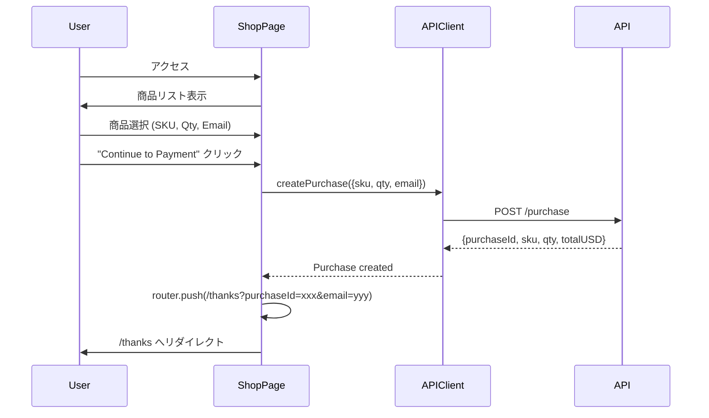
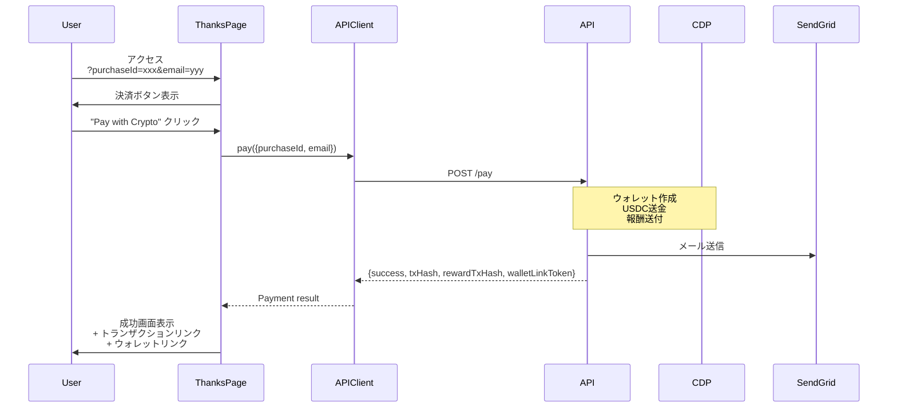
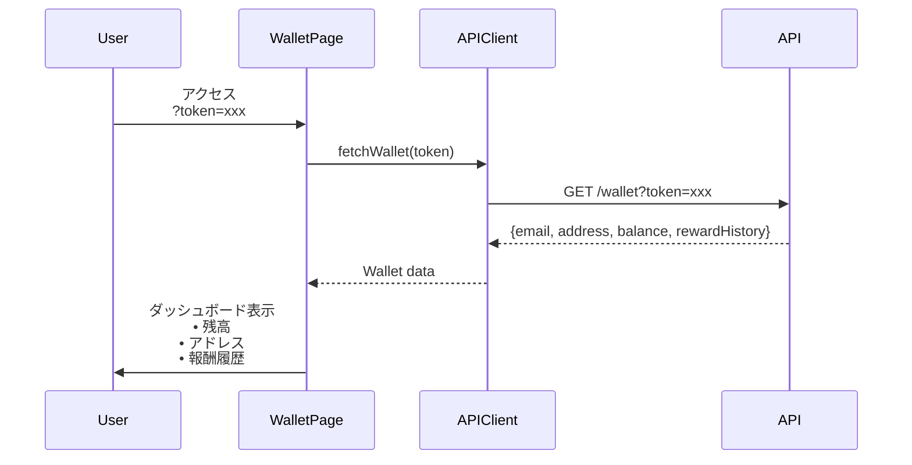

# Crypify Web Service (Cloud Run)

## サービス概要

Next.js 14 ベースの Server-Side Rendering (SSR) Webアプリケーション。ユーザー向けのショッピング、決済、ウォレット管理UIを提供します。

**デプロイ先**: Google Cloud Run (`crypify-web`)  
**リージョン**: asia-northeast1 (東京)  
**言語**: TypeScript (Node.js 20)  
**フレームワーク**: Next.js 14.2.33 (App Router)

## アーキテクチャ

```
┌────────────────────────────────────────────┐
│       Crypify Web (Cloud Run)              │
├────────────────────────────────────────────┤
│                                            │
│  ┌──────────────────────────────────┐     │
│  │      Next.js App Router           │     │
│  ├──────────────────────────────────┤     │
│  │  • Server Components              │     │
│  │  • Client Components              │     │
│  │  • Route Handlers                 │     │
│  └──────────────────────────────────┘     │
│               │                            │
│               ▼                            │
│  ┌──────────────────────────────────┐     │
│  │       Page Components             │     │
│  ├──────────────────────────────────┤     │
│  │  / (Home)                         │     │
│  │  /shop (Product Selection)        │     │
│  │  /thanks (Payment Execution)      │     │
│  │  /wallet (Wallet Dashboard)       │     │
│  └──────────────────────────────────┘     │
│               │                            │
│               ▼                            │
│  ┌──────────────────────────────────┐     │
│  │       API Client Layer            │     │
│  ├──────────────────────────────────┤     │
│  │  lib/api.ts                       │     │
│  │  • createPurchase()               │     │
│  │  • pay()                          │     │
│  │  • fetchWallet()                  │     │
│  └──────────────────────────────────┘     │
│               │                            │
└───────────────┼────────────────────────────┘
                │
                ▼
      ┌──────────────────┐
      │  Crypify API     │
      │  (Cloud Run)     │
      └──────────────────┘
```

## ページ構成

| パス | 説明 | レンダリング |
|------|------|--------------|
| `/` | ホーム（リダイレクト） | Static |
| `/shop` | 商品選択ページ | Client |
| `/thanks` | 決済実行ページ | Client (Suspense) |
| `/wallet` | ウォレットダッシュボード | Client (Suspense) |

## ページフロー詳細

### 1. / (Home Page)

**目的**: ルートページ（/shop へリダイレクト）

```typescript
// app/page.tsx
export default function Home() {
  redirect('/shop');
}
```

**処理**: サーバー側で即座にリダイレクト

### 2. /shop (Product Selection)

**目的**: 商品選択と購入レコード作成



**実装詳細**:

```typescript
// app/shop/page.tsx
"use client";

const PRODUCTS = [
  { sku: "hoodie", name: "Crypify Hoodie", price: 50, emoji: "👕" },
  { sku: "tshirt", name: "Crypify T-Shirt", price: 25, emoji: "👔" },
  { sku: "cap", name: "Crypify Cap", price: 15, emoji: "🧢" },
];

export default function ShopPage() {
  const [selectedSku, setSelectedSku] = useState("hoodie");
  const [qty, setQty] = useState(1);
  const [email, setEmail] = useState("");

  const handleSubmit = async (e) => {
    e.preventDefault();
    const result = await createPurchase({ sku: selectedSku, qty, email });
    router.push(`/thanks?purchaseId=${result.purchaseId}&email=${email}`);
  };

  return (
    <form onSubmit={handleSubmit}>
      {/* Product selector */}
      {/* Quantity input */}
      {/* Email input */}
      <button type="submit">Continue to Payment →</button>
    </form>
  );
}
```

**API呼び出し**:

```typescript
// lib/api.ts
export async function createPurchase(data: {
  sku: string;
  qty: number;
  email: string;
}) {
  const res = await fetch(`${API_BASE_URL}/purchase`, {
    method: 'POST',
    headers: { 'Content-Type': 'application/json' },
    body: JSON.stringify(data),
  });

  if (!res.ok) {
    const error = await res.json();
    throw new Error(error.error || 'Failed to create purchase');
  }

  return res.json();
}
```

**UI要素**:
- 商品選択ドロップダウン
- 数量入力（1-10）
- メールアドレス入力
- 合計金額表示
- 送信ボタン

**エラーハンドリング**:
- ネットワークエラー
- バリデーションエラー（API側）
- 在庫不足エラー

### 3. /thanks (Payment Execution)

**目的**: 決済実行とトランザクション表示



**実装詳細**:

```typescript
// app/thanks/page.tsx
"use client";

function ThanksContent() {
  const searchParams = useSearchParams();
  const purchaseId = searchParams.get("purchaseId");
  const email = searchParams.get("email");

  const [loading, setLoading] = useState(false);
  const [success, setSuccess] = useState(false);
  const [result, setResult] = useState(null);

  const handlePay = async () => {
    setLoading(true);
    const paymentResult = await pay({ purchaseId, email });
    setResult(paymentResult);
    setSuccess(true);
  };

  if (success && result) {
    return (
      <div>
        <h1>🎉 Payment Successful!</h1>
        <p>Payment TX: <a href={basescan}>{result.txHash}</a></p>
        <p>Reward TX: <a href={basescan}>{result.rewardTxHash}</a></p>
        <a href={`/wallet?token=${result.walletLinkToken}`}>
          View Your Wallet 🔗
        </a>
      </div>
    );
  }

  return (
    <div>
      <h1>💳 Complete Payment</h1>
      <button onClick={handlePay} disabled={loading}>
        {loading ? "Processing..." : "Pay with Crypto 🚀"}
      </button>
    </div>
  );
}

export default function ThanksPage() {
  return (
    <Suspense fallback={<div>Loading...</div>}>
      <ThanksContent />
    </Suspense>
  );
}
```

**UI要素**:

決済前:
- Purchase ID 表示
- 処理内容の説明（ウォレット作成、送金、報酬）
- 決済ボタン

決済後:
- 成功メッセージ
- Payment トランザクションリンク（Basescan）
- Reward トランザクションリンク（Basescan）
- ウォレットアクセスボタン
- メール確認の案内

**Suspense Boundary**:

```typescript
// useSearchParams() は Suspense が必須
<Suspense fallback={<div>Loading...</div>}>
  <ThanksContent />
</Suspense>
```

Next.js 14 では `useSearchParams()` を使う Client Component は Suspense でラップする必要があります。

**エラーハンドリング**:
- Missing purchase info (400)
- Payment failed (500)
- Network errors

### 4. /wallet (Wallet Dashboard)

**目的**: ウォレット情報と報酬履歴の表示



**実装詳細**:

```typescript
// app/wallet/page.tsx
"use client";

function WalletContent() {
  const searchParams = useSearchParams();
  const token = searchParams.get("token");

  const [wallet, setWallet] = useState<WalletResponse | null>(null);
  const [loading, setLoading] = useState(true);

  useEffect(() => {
    if (!token) return;
    loadWallet();
  }, [token]);

  const loadWallet = async () => {
    const data = await fetchWallet(token);
    setWallet(data);
    setLoading(false);
  };

  if (loading) return <div>Loading...</div>;
  if (!wallet) return <div>Wallet not found</div>;

  return (
    <div>
      <h1>💼 Your Wallet</h1>
      
      {/* Balance Display */}
      <div className="balance-card">
        <p>Total Balance</p>
        <h2>${wallet.balance}</h2>
        <p>USDC</p>
      </div>

      {/* Wallet Info */}
      <div>
        <p>Email: {wallet.email}</p>
        <p>Address: <a href={basescan}>{wallet.address}</a></p>
      </div>

      {/* Reward History */}
      <h3>Reward History</h3>
      {wallet.rewardHistory.map(reward => (
        <div key={reward.txHash}>
          <p>+${reward.amount} USDC</p>
          <p>{new Date(reward.timestamp).toLocaleString()}</p>
          <a href={basescan}>View TX ↗</a>
        </div>
      ))}

      <a href="/shop">Shop More 🛍️</a>
    </div>
  );
}

export default function WalletPage() {
  return (
    <Suspense fallback={<div>Loading...</div>}>
      <WalletContent />
    </Suspense>
  );
}
```

**UI要素**:

残高カード:
- グラデーション背景
- 大きな金額表示
- USDC ラベル

ウォレット情報:
- メールアドレス
- ウォレットアドレス（Basescan リンク）

報酬履歴:
- 報酬額
- 受取日時
- トランザクションリンク

アクション:
- "Shop More" ボタン（/shop へ戻る）

**エラーハンドリング**:
- Missing token (400)
- Invalid token (404)
- Wallet not found (404)

## API Client Layer

### lib/api.ts

すべてのAPI呼び出しを集約：

```typescript
const API_BASE_URL = process.env.NEXT_PUBLIC_API_BASE_URL || 'http://localhost:8080';

export async function createPurchase(data: {
  sku: string;
  qty: number;
  email: string;
}) {
  const res = await fetch(`${API_BASE_URL}/purchase`, {
    method: 'POST',
    headers: { 'Content-Type': 'application/json' },
    body: JSON.stringify(data),
  });

  if (!res.ok) {
    const error = await res.json();
    throw new Error(error.error || 'Failed to create purchase');
  }

  return res.json();
}

export async function pay(data: {
  purchaseId: string;
  email: string;
}) {
  const res = await fetch(`${API_BASE_URL}/pay`, {
    method: 'POST',
    headers: { 'Content-Type': 'application/json' },
    body: JSON.stringify(data),
  });

  if (!res.ok) {
    const error = await res.json();
    throw new Error(error.error || 'Payment failed');
  }

  return res.json();
}

export interface WalletResponse {
  email: string;
  address: string;
  balance: string;
  rewardHistory: Array<{
    txHash: string;
    amount: string;
    timestamp: number;
  }>;
}

export async function fetchWallet(token: string): Promise<WalletResponse> {
  const res = await fetch(`${API_BASE_URL}/wallet?token=${token}`);

  if (!res.ok) {
    const error = await res.json();
    throw new Error(error.error || 'Failed to fetch wallet');
  }

  return res.json();
}
```

## スタイリング

### グローバルスタイル

```css
/* app/globals.css */
.container {
  max-width: 600px;
  margin: 0 auto;
  padding: 40px 20px;
}

.card {
  background: white;
  padding: 40px;
  border-radius: 16px;
  box-shadow: 0 4px 20px rgba(0,0,0,0.1);
}

.button {
  background: linear-gradient(135deg, #667eea 0%, #764ba2 100%);
  color: white;
  padding: 16px 32px;
  border: none;
  border-radius: 8px;
  font-size: 16px;
  font-weight: 600;
  cursor: pointer;
  transition: transform 0.2s;
}

.button:hover {
  transform: translateY(-2px);
}

.button:disabled {
  opacity: 0.6;
  cursor: not-allowed;
}

.error {
  background: #fee;
  color: #c00;
  padding: 12px;
  border-radius: 6px;
  margin-bottom: 16px;
}

.success {
  background: #efe;
  color: #060;
  padding: 12px;
  border-radius: 6px;
  margin-bottom: 16px;
}
```

## 環境変数

### 必須環境変数

| 変数名 | 説明 | 例 |
|--------|------|-----|
| `NEXT_PUBLIC_API_BASE_URL` | API サービスURL | `https://crypify-api-xxx.a.run.app` |

**注意**: `NEXT_PUBLIC_` プレフィックスは Client Component から参照可能にするために必要

### ローカル開発

```bash
# web/.env.local
NEXT_PUBLIC_API_BASE_URL=http://localhost:8080
```

### 本番環境

```bash
# Cloud Run 環境変数
NEXT_PUBLIC_API_BASE_URL=https://crypify-api-xxx.a.run.app
```

## ビルドとデプロイ

### ビルドプロセス

```bash
# 依存関係インストール
pnpm install

# 本番ビルド
pnpm build
```

**出力**:
```
Route (app)                              Size     First Load JS
┌ ○ /                                    137 B          87.4 kB
├ ○ /_not-found                          872 B          88.1 kB
├ ○ /shop                                2.05 kB        89.3 kB
├ ○ /thanks                              2.23 kB        89.5 kB
└ ○ /wallet                              2.25 kB        89.5 kB
```

全ページが Static Generation されます。

### Dockerfile

```dockerfile
FROM node:20-alpine AS builder

WORKDIR /root/monorepo

# Install pnpm
RUN corepack enable && corepack prepare pnpm@9.0.0 --activate

# Copy workspace files
COPY pnpm-workspace.yaml package.json pnpm-lock.yaml ./
COPY web/package.json ./web/
COPY web/tsconfig.json ./web/
COPY web/next.config.ts ./web/

# Install dependencies
RUN pnpm install --frozen-lockfile

# Copy source
COPY web/app ./web/app
COPY web/public ./web/public

# Build
WORKDIR /root/monorepo/web
RUN pnpm build

# Production image
FROM node:20-alpine

WORKDIR /root/monorepo

RUN corepack enable && corepack prepare pnpm@9.0.0 --activate

COPY pnpm-workspace.yaml package.json pnpm-lock.yaml ./
COPY web/package.json ./web/
COPY web/next.config.ts ./web/

# Install production dependencies
RUN pnpm install --prod --frozen-lockfile

# Copy built files
COPY --from=builder /root/monorepo/web/.next ./web/.next
COPY --from=builder /root/monorepo/web/public ./web/public

WORKDIR /root/monorepo/web

ENV NODE_ENV=production
ENV PORT=8080

EXPOSE 8080

CMD ["pnpm", "start"]
```

### GitHub Actions デプロイ

トリガー:
- `web/**` の変更を含む `main` ブランチへの push
- 手動実行

処理:
1. Docker イメージビルド
2. Artifact Registry へプッシュ
3. Cloud Run へデプロイ
4. 環境変数設定（API_BASE_URL）

## パフォーマンス

### ページロード時間

| ページ | Time to Interactive | First Contentful Paint |
|--------|-------------------|----------------------|
| /shop | ~500ms | ~200ms |
| /thanks | ~500ms | ~200ms |
| /wallet | ~800ms | ~200ms |

**注意**: /wallet は API呼び出しがあるため若干遅い

### 最適化

- ✅ Static Generation（全ページ）
- ✅ Image Optimization（Next.js自動）
- ✅ Code Splitting（自動）
- ✅ CSS Minification

### スケーリング設定

```yaml
# Cloud Run設定
minInstances: 0      # アイドル時はインスタンス0
maxInstances: 10     # 最大10インスタンス
cpu: 1               # 1 vCPU
memory: 512Mi        # 512MB RAM
concurrency: 80      # 1インスタンスあたり80並行リクエスト
timeout: 60s         # タイムアウト60秒
```

## セキュリティ

### 実装済み

- ✅ HTTPS必須（Cloud Run）
- ✅ 環境変数による設定管理
- ✅ XSS対策（React自動エスケープ）
- ✅ CSP Headers（Next.js）

### TODO

- [ ] CORS設定の厳格化
- [ ] Rate Limiting
- [ ] CSP の強化
- [ ] Content Security Policy

## エラーハンドリング

### クライアント側エラー

```typescript
try {
  const result = await createPurchase(data);
} catch (err) {
  setError(err instanceof Error ? err.message : "Something went wrong");
}
```

### ネットワークエラー

```typescript
if (!res.ok) {
  const error = await res.json();
  throw new Error(error.error || 'Request failed');
}
```

### ユーザーフィードバック

- エラーメッセージを赤背景で表示
- 成功メッセージを緑背景で表示
- ローディング状態でボタンを無効化

## モニタリング

### ログ確認

```bash
# リアルタイムログ
gcloud run services logs tail crypify-web --region=asia-northeast1

# エラーログのみ
gcloud run services logs read crypify-web \
  --region=asia-northeast1 \
  --filter="severity>=ERROR"
```

### メトリクス

```bash
# リクエスト数
gcloud monitoring time-series list \
  --filter='metric.type="run.googleapis.com/request_count" AND resource.label.service_name="crypify-web"'
```

## TODO

### 優先度: 高

- [ ] エラーバウンダリの実装
- [ ] ローディング状態の改善
- [ ] レスポンシブデザインの強化

### 優先度: 中

- [ ] PWA対応
- [ ] オフライン対応
- [ ] Analytics統合

### 優先度: 低

- [ ] Dark Mode
- [ ] 多言語対応
- [ ] アニメーション強化
