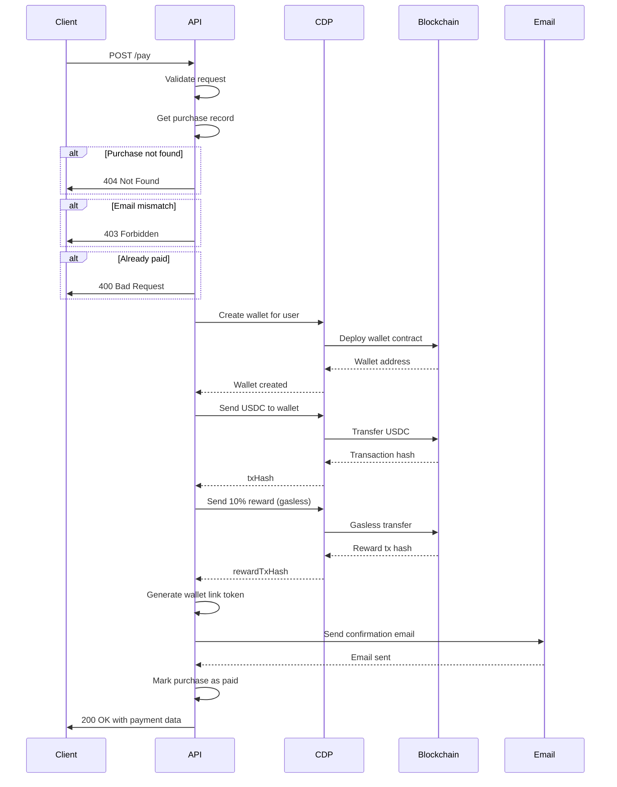

# Pay Endpoint

## 概要

購入に対する支払いを実行するエンドポイント。CDP（Coinbase Developer Platform）を使用してウォレット作成、USDC送金、ガスレス報酬送付、メール送信を行います。

## エンドポイント

```
POST /pay
```

## リクエスト

### Headers

```
Content-Type: application/json
```

### Body

```typescript
{
  purchaseId: string;  // 購入ID
  email: string;       // 購入者メールアドレス
}
```

### 例

```json
{
  "purchaseId": "PUR-1732234567890-abc123def",
  "email": "user@example.com"
}
```

## レスポンス

### 成功時 (200 OK)

```typescript
{
  success: boolean;           // 成功フラグ
  txHash: string;            // USDC送金トランザクションハッシュ
  rewardTxHash: string;      // 報酬送金トランザクションハッシュ
  walletLinkToken: string;   // ウォレットアクセストークン
  message: string;           // メッセージ
}
```

### 例

```json
{
  "success": true,
  "txHash": "0x1234567890abcdef...",
  "rewardTxHash": "0xfedcba0987654321...",
  "walletLinkToken": "abc123def456...",
  "message": "Payment successful! Check your email."
}
```

### エラー時

#### 400 Bad Request

```json
{
  "error": "Missing required fields"
}
```

```json
{
  "error": "Already paid"
}
```

#### 403 Forbidden

```json
{
  "error": "Email mismatch"
}
```

#### 404 Not Found

```json
{
  "error": "Purchase not found"
}
```

#### 500 Internal Server Error

```json
{
  "error": "Payment failed",
  "details": "Error message details"
}
```

## 処理フロー



## CDP処理詳細

### 1. ウォレット作成

```typescript
const wallet = await Coinbase.createWallet({
  networkId: "base-sepolia",
});

const address = await wallet.getDefaultAddress();
```

- **ネットワーク**: Base Sepolia (テストネット)
- **ウォレットタイプ**: Server-signer model (サーバー管理)
- **保存**: in-memory（本番環境ではDB保存が必要）

### 2. USDC送金

```typescript
// TODO: 実装が必要
const transfer = await masterWallet.createTransfer({
  amount: totalUSD,
  assetId: "USDC",
  destination: userWalletAddress,
  networkId: "base-sepolia",
});

await transfer.wait();
const txHash = transfer.getTransactionHash();
```

**現在の実装**: モック（ダミーtxHashを返す）

**本番実装に必要なもの**:
- マスターウォレットの作成と資金供給
- USDC契約アドレス: `0x036CbD53842c5426634e7929541eC2318f3dCF7e`

### 3. ガスレス報酬送金（10%）

```typescript
// TODO: 実装が必要
const rewardTransfer = await Coinbase.createTransfer({
  amount: totalUSD * 0.1,
  assetId: "USDC",
  destination: userWalletAddress,
  networkId: "base-sepolia",
  gasless: true,  // ガス代をスポンサー
});

await rewardTransfer.wait();
const rewardTxHash = rewardTransfer.getTransactionHash();
```

**現在の実装**: モック（ダミーtxHashを返す）

**ガスレスの仕組み**:
- CDP が gas fees を負担
- ユーザーはガス代不要で受け取り可能

### 4. ウォレットリンクトークン生成

```typescript
const token = crypto.randomBytes(32).toString('hex');
```

- **用途**: `/wallet` エンドポイントでウォレット情報を取得
- **保存**: in-memory Map（email ⇔ token）
- **セキュリティ**: 本番環境では有効期限と暗号化が必要

## メール送信

### 送信内容

- **件名**: `✅ Payment Confirmed - {purchaseId}`
- **本文**: HTML + プレーンテキスト
- **含まれる情報**:
  - 購入詳細（SKU, 数量, 金額）
  - トランザクションハッシュ（Basescan リンク）
  - 報酬トランザクションハッシュ
  - ウォレットアクセスリンク

### SMTP設定

```env
SMTP_HOST=smtp.gmail.com
SMTP_PORT=587
SMTP_USER=your_email@gmail.com
SMTP_PASS=your_app_password
FROM_EMAIL=noreply@crypify.app
FRONTEND_URL=https://crypify-web.a.run.app
```

### モックモード

SMTP認証情報が未設定の場合、コンソールにログ出力のみ。

## データモデル

### Wallet Data (In-Memory)

```typescript
interface WalletData {
  email: string;
  address: string;
  walletId: string;
  seed: string;                    // ウォレットシードフレーズ
  createdAt: number;
  rewardHistory: Array<{
    txHash: string;
    amount: string;
    timestamp: number;
  }>;
}
```

**⚠️ セキュリティ警告**: 
- `seed` は暗号化してDB保存すべき
- 現在はin-memoryで平文保存（開発環境のみ）

## エラーハンドリング

### よくあるエラー

1. **CDP API認証エラー**
   ```
   CDP_API_KEY and CDP_API_SECRET must be set
   ```

2. **ウォレット作成失敗**
   - ネットワーク接続エラー
   - CDP APIクォータ超過

3. **トランザクション失敗**
   - 残高不足（マスターウォレット）
   - ガス代不足
   - ネットワーク混雑

4. **メール送信失敗**
   - SMTP認証エラー
   - レート制限

## セキュリティ考慮事項

### 実装済み

- リクエストバリデーション
- 購入レコードの所有権確認（email match）
- 二重支払い防止（paid フラグ）

### TODO

- [ ] ウォレットシードの暗号化
- [ ] トランザクション署名の検証
- [ ] Webhook による支払い確認
- [ ] タイムアウト処理
- [ ] リトライロジック
- [ ] 監査ログ

## パフォーマンス考慮事項

- **平均処理時間**: 3-5秒
  - ウォレット作成: ~1秒
  - USDC送金: ~2秒
  - 報酬送金: ~1秒
  - メール送信: ~0.5秒

- **並列処理の可能性**: 
  - メール送信は非同期で良い（TODO）

## TODO

- [ ] マスターウォレットの実装
- [ ] 実際のCDP API呼び出し
- [ ] データベース永続化
- [ ] Webhook による確認
- [ ] エラーリトライ
- [ ] タイムアウト処理
- [ ] 詳細なログ記録
- [ ] メトリクス収集
