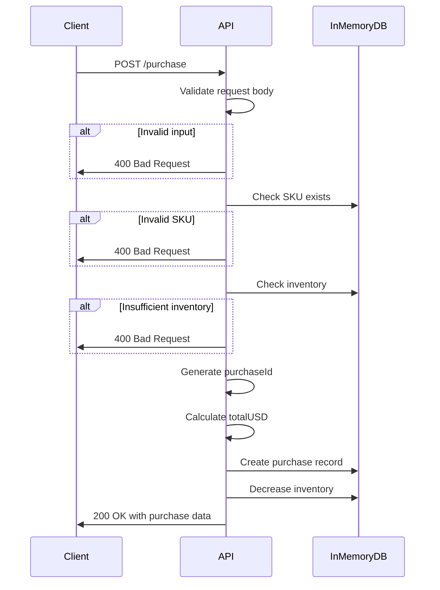

# Purchase Endpoint

## 概要

商品の購入レコードを作成するエンドポイント。在庫チェックを行い、購入IDを発行します。

## エンドポイント

```
POST /purchase
```

## リクエスト

### Headers

```
Content-Type: application/json
```

### Body

```typescript
{
  sku: string;      // 商品SKU (例: "hoodie", "tshirt", "cap")
  qty: number;      // 数量 (1以上)
  email: string;    // 購入者のメールアドレス
}
```

### 例

```json
{
  "sku": "hoodie",
  "qty": 2,
  "email": "user@example.com"
}
```

## レスポンス

### 成功時 (200 OK)

```typescript
{
  purchaseId: string;  // 購入ID (例: "PUR-1732234567890-abc123def")
  sku: string;         // 商品SKU
  qty: number;         // 数量
  totalUSD: number;    // 合計金額（USD）
}
```

### 例

```json
{
  "purchaseId": "PUR-1732234567890-abc123def",
  "sku": "hoodie",
  "qty": 2,
  "totalUSD": 100.00
}
```

### エラー時

#### 400 Bad Request

```json
{
  "error": "Missing required fields"
}
```

```json
{
  "error": "Invalid SKU"
}
```

```json
{
  "error": "Insufficient inventory"
}
```

#### 500 Internal Server Error

```json
{
  "error": "Internal server error"
}
```

## 処理フロー



## データモデル

### Purchase Record (In-Memory)

```typescript
interface Purchase {
  id: string;          // 購入ID
  sku: string;         // 商品SKU
  qty: number;         // 数量
  email: string;       // 購入者メール
  totalUSD: number;    // 合計金額
  paid: boolean;       // 支払い済みフラグ
  createdAt: number;   // 作成日時（Unix timestamp）
}
```

### Inventory (In-Memory)

```typescript
Map<string, number>  // SKU → 在庫数
```

初期在庫:
- `hoodie`: 100
- `tshirt`: 200
- `cap`: 150

### Prices (In-Memory)

```typescript
Map<string, number>  // SKU → 価格（USD）
```

価格表:
- `hoodie`: $50
- `tshirt`: $25
- `cap`: $15

## ビジネスロジック

1. **バリデーション**
   - `sku`, `qty`, `email` が必須
   - `sku` が在庫リストに存在すること
   - `qty` が在庫数以下であること

2. **購入ID生成**
   - フォーマット: `PUR-{timestamp}-{random}`
   - 例: `PUR-1732234567890-abc123def`

3. **在庫予約**
   - 在庫数を減らす（即座に予約）
   - 支払いキャンセル時の在庫戻し処理は未実装（TODO）

4. **レコード作成**
   - `paid: false` で作成
   - `/pay` エンドポイントで `paid: true` に更新

## セキュリティ考慮事項

- **レート制限**: 未実装（TODO: 同一メールアドレスからの連続リクエスト制限）
- **在庫枯渇攻撃**: 未実装（TODO: 未払い購入の自動キャンセル）
- **入力検証**: 基本的なバリデーションのみ

## TODO

- [ ] データベース永続化（現在はin-memory）
- [ ] 在庫戻し処理（支払いタイムアウト/キャンセル時）
- [ ] レート制限の実装
- [ ] より詳細なバリデーション（メールフォーマット等）
- [ ] トランザクション処理
- [ ] 購入履歴の管理
