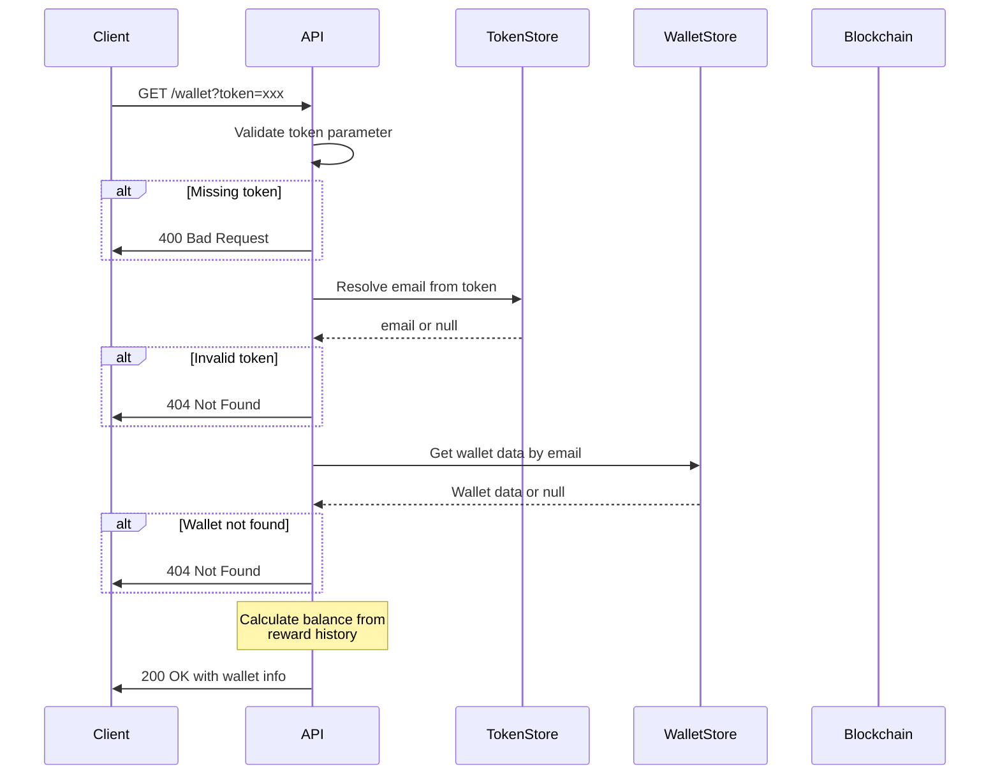

# Wallet Endpoint

## 概要

ウォレット情報を取得するエンドポイント。トークンベースの認証で、ユーザーの残高と報酬履歴を表示します。

## エンドポイント

```
GET /wallet?token={token}
```

## リクエスト

### Query Parameters

| パラメータ | 型 | 必須 | 説明 |
|----------|------|------|------|
| token | string | Yes | ウォレットアクセストークン |

### 例

```
GET /wallet?token=abc123def456789...
```

## レスポンス

### 成功時 (200 OK)

```typescript
{
  email: string;        // ユーザーメールアドレス
  address: string;      // ウォレットアドレス
  balance: string;      // 残高（USD）
  rewardHistory: Array<{
    txHash: string;     // トランザクションハッシュ
    amount: string;     // 報酬額（USD）
    timestamp: number;  // Unix timestamp
  }>;
}
```

### 例

```json
{
  "email": "user@example.com",
  "address": "0x1234567890abcdef1234567890abcdef12345678",
  "balance": "15.50",
  "rewardHistory": [
    {
      "txHash": "0xfedcba0987654321...",
      "amount": "5.00",
      "timestamp": 1732234567890
    },
    {
      "txHash": "0xabcdef1234567890...",
      "amount": "10.50",
      "timestamp": 1732234600000
    }
  ]
}
```

### エラー時

#### 400 Bad Request

```json
{
  "error": "Missing token parameter"
}
```

#### 404 Not Found

```json
{
  "error": "Invalid or expired token"
}
```

```json
{
  "error": "Wallet not found"
}
```

#### 500 Internal Server Error

```json
{
  "error": "Failed to fetch wallet",
  "details": "Error message details"
}
```

## 処理フロー



## データ取得詳細

### 1. トークンからメール解決

```typescript
const email = tokenToEmail.get(token);
if (!email) {
  return res.status(404).json({ error: "Invalid or expired token" });
}
```

**In-Memory Storage**:
```typescript
Map<string, string>  // token → email
Map<string, string>  // email → token
```

**セキュリティ考慮**:
- トークンは32バイトランダム（256bit）
- 本番環境では有効期限が必要
- JWT等の標準トークンへの移行を推奨

### 2. ウォレット情報取得

```typescript
const walletData = wallets.get(email);
```

**WalletData構造**:
```typescript
interface WalletData {
  email: string;
  address: string;
  walletId: string;
  seed: string;
  createdAt: number;
  rewardHistory: Array<{
    txHash: string;
    amount: string;
    timestamp: number;
  }>;
}
```

### 3. 残高計算

**現在の実装** (In-Memory):
```typescript
const balance = walletData.rewardHistory
  .reduce((sum, r) => sum + parseFloat(r.amount), 0)
  .toFixed(2);
```

**本番実装** (Blockchain):
```typescript
const wallet = await Coinbase.importWallet({
  walletId: walletData.walletId,
  seed: walletData.seed,
});

const balance = await wallet.getBalance("USDC");
```

## 報酬履歴

### データ構造

```typescript
interface RewardRecord {
  txHash: string;      // Base Sepolia transaction hash
  amount: string;      // USDC amount (e.g., "5.00")
  timestamp: number;   // Unix timestamp in milliseconds
}
```

### 表示フォーマット

フロントエンド側で以下のように表示:

```typescript
// 日時フォーマット
new Date(timestamp).toLocaleString()
// 例: "11/22/2025, 3:45:30 PM"

// トランザクションリンク
`https://sepolia.basescan.org/tx/${txHash}`
```

### ソート順

- 最新の報酬が最初（timestamp降順）
- 現在の実装では配列の順序がそのまま使用される
- TODO: 明示的なソート処理

## データソース

### 開発環境 (In-Memory)

```typescript
const wallets: Map<string, WalletData> = new Map();
```

- サーバー再起動でデータ消失
- 複数インスタンス間で共有不可
- テスト・開発専用

### 本番環境 (要実装)

**推奨データベース**:
- **PostgreSQL**: リレーショナルデータ
- **Firebase Firestore**: NoSQL、リアルタイム
- **MongoDB**: ドキュメント指向

**テーブル設計例**:

```sql
CREATE TABLE wallets (
  email VARCHAR(255) PRIMARY KEY,
  address VARCHAR(42) NOT NULL,
  wallet_id VARCHAR(255) NOT NULL,
  encrypted_seed TEXT NOT NULL,
  created_at TIMESTAMP NOT NULL
);

CREATE TABLE rewards (
  id SERIAL PRIMARY KEY,
  email VARCHAR(255) REFERENCES wallets(email),
  tx_hash VARCHAR(66) NOT NULL,
  amount DECIMAL(18,6) NOT NULL,
  timestamp TIMESTAMP NOT NULL,
  INDEX idx_email_timestamp (email, timestamp DESC)
);
```

## トークン管理

### トークン生成

```typescript
const token = crypto.randomBytes(32).toString('hex');
emailToToken.set(email, token);
tokenToEmail.set(token, email);
```

### セキュリティ考慮事項

**現在の実装の問題点**:
- 有効期限なし
- 無効化機能なし
- 平文保存

**推奨される改善**:

1. **JWT使用**:
```typescript
const token = jwt.sign(
  { email },
  JWT_SECRET,
  { expiresIn: '7d' }
);
```

2. **Redis等で管理**:
```typescript
await redis.setex(token, 604800, email);  // 7日間
```

3. **リフレッシュトークン**:
- アクセストークン（短期）
- リフレッシュトークン（長期）

## キャッシング

### 現在の実装

- キャッシュなし
- 毎回in-memoryストアから取得

### 推奨される実装

```typescript
// Redis でキャッシュ
const cacheKey = `wallet:${email}`;
let walletData = await redis.get(cacheKey);

if (!walletData) {
  walletData = await db.getWallet(email);
  await redis.setex(cacheKey, 300, JSON.stringify(walletData));
}
```

- **キャッシュTTL**: 5分
- **無効化**: 報酬追加時

## パフォーマンス

### レスポンスタイム

- **In-Memory**: <10ms
- **DB (indexed)**: <50ms
- **Blockchain query**: 500-1000ms (avoid in sync calls)

### スケーラビリティ

- **Read-heavy**: キャッシュ必須
- **Write-once**: ウォレット作成は1回のみ
- **Append-only**: 報酬履歴は追加のみ

## セキュリティ考慮事項

### 実装済み

- トークンベース認証
- メールアドレスの隠蔽（トークン経由のみ）

### TODO

- [ ] トークン有効期限
- [ ] レート制限
- [ ] アクセスログ
- [ ] 不正アクセス検知
- [ ] CORS設定の厳格化
- [ ] HTTPS必須化

## エラーハンドリング

### よくあるエラー

1. **トークン無効**
   - 原因: URLコピペミス、有効期限切れ
   - 対処: メールから再度アクセス

2. **ウォレット未作成**
   - 原因: `/pay` が未完了
   - 対処: 支払いプロセスを完了

3. **残高不一致**
   - 原因: Blockchain同期遅延
   - 対処: 数分待って再読み込み

## TODO

- [ ] データベース永続化
- [ ] JWT トークン実装
- [ ] キャッシング実装
- [ ] ページネーション（報酬履歴が多い場合）
- [ ] リアルタイム残高取得
- [ ] 複数ウォレット対応
- [ ] トランザクション詳細表示
- [ ] CSV エクスポート
- [ ] 通知設定
